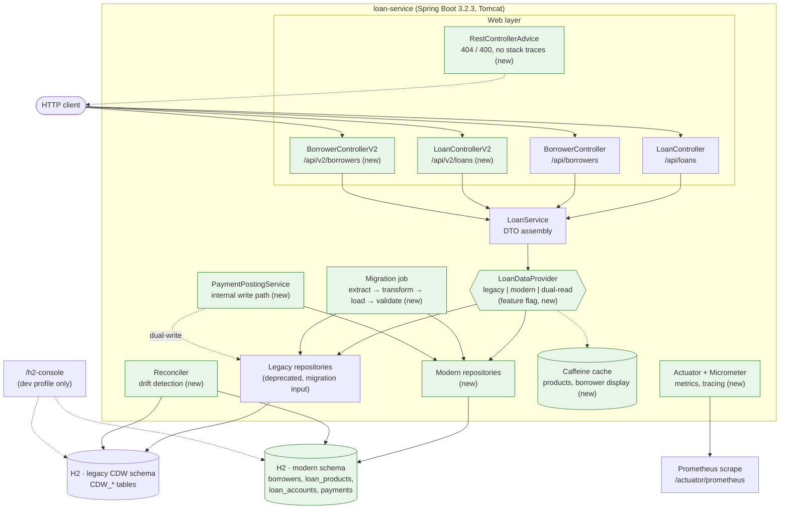
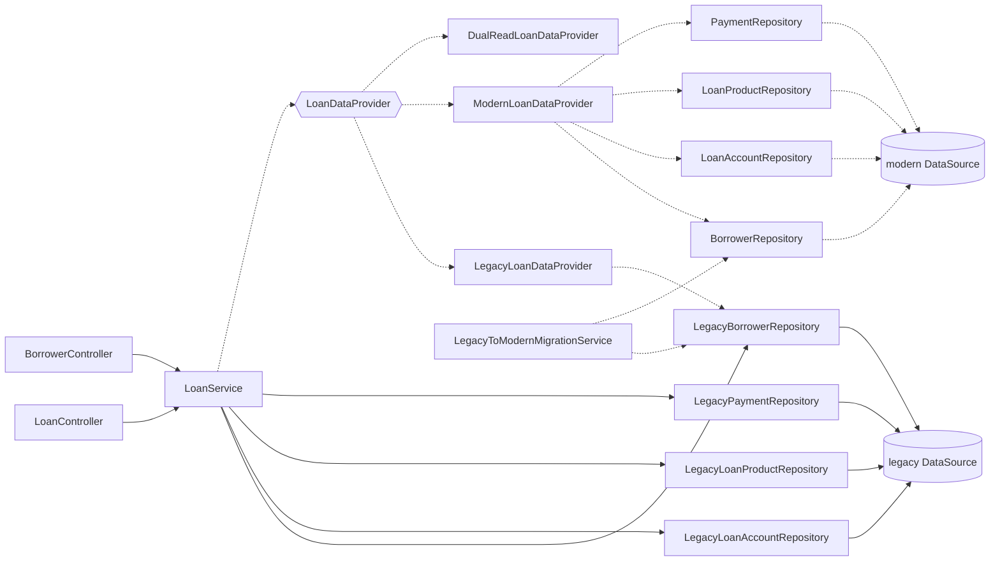
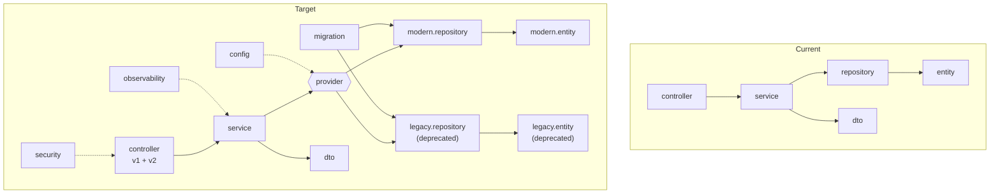
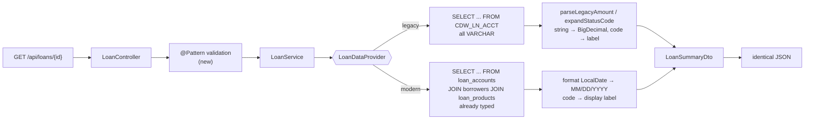
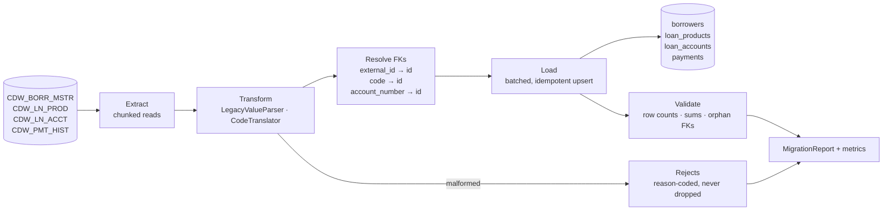
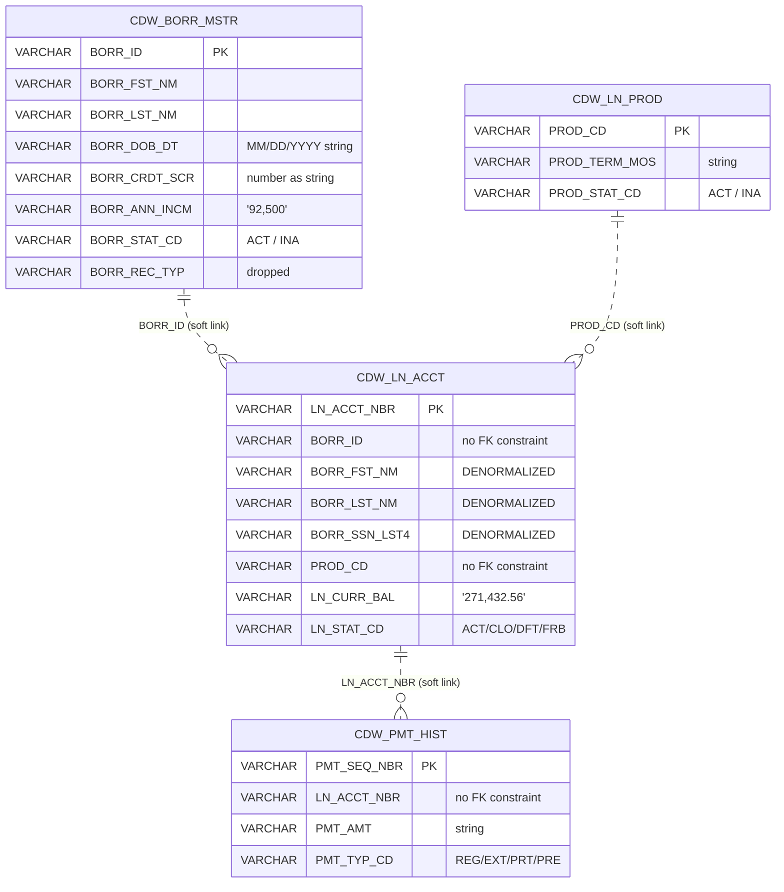
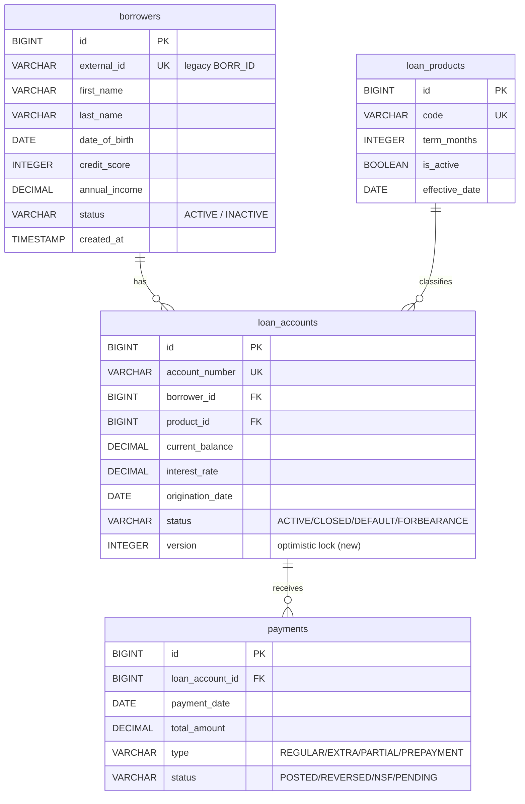
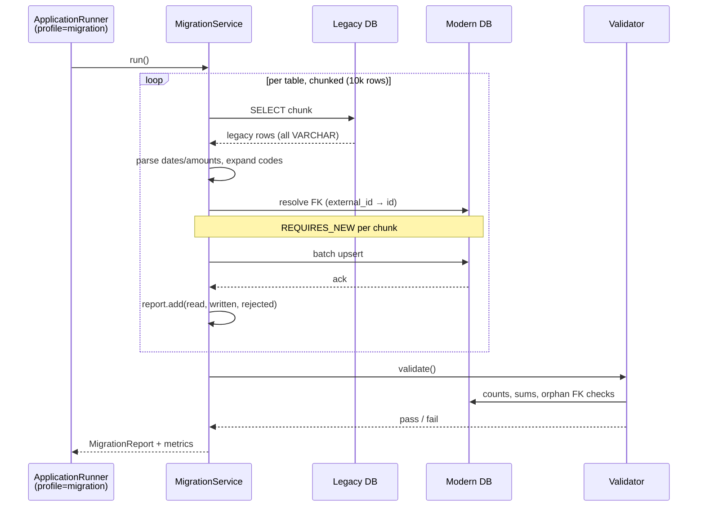
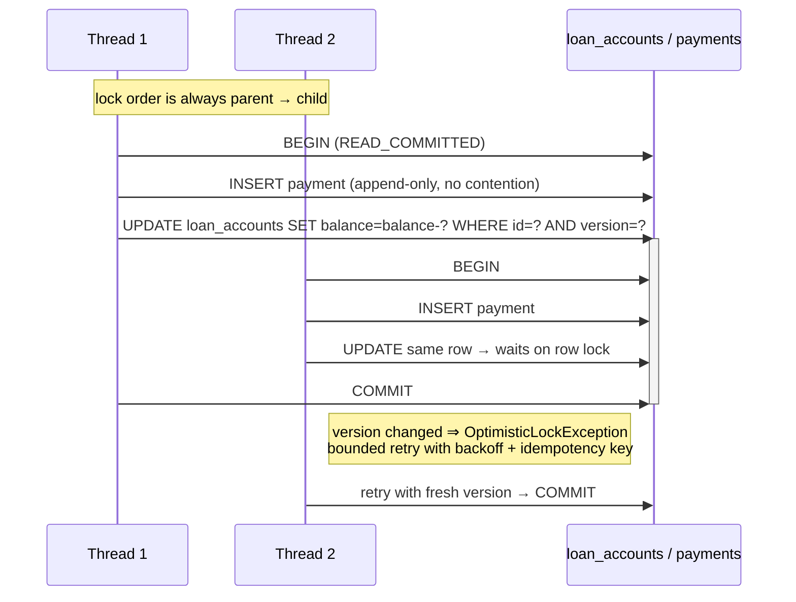

# Data Source Migration: Legacy to Modern

A small Spring Boot loan management application that currently connects to a **legacy data warehouse** (simulated via H2 with legacy-style schemas). The workshop challenge is to migrate the data source to a **modern schema** while keeping the application functional.

## Overview

This app manages loan data: borrowers, loan products, loan accounts, and payment history. It currently reads from legacy tables with denormalized structures, cryptic column names, and outdated patterns. The goal is to rewire it to use a normalized modern schema with clear naming conventions.

## Architecture

Detailed narrative, measurements and decisions: [`docs/ARCHITECTURE_ANALYSIS.md`](docs/ARCHITECTURE_ANALYSIS.md).
Diagrams below show the **as-is (legacy)** and **to-be (modern)** states.

### 1. Component diagram



Green = added by the migration. Everything else exists today.

### 2. Dependency graph

Bean-level wiring (as-is solid, to-be dashed):



No cycles; no controller reaches a repository directly. Key runtime dependencies from
`mvn dependency:tree`: Spring Boot 3.2.3 · Spring 6.1.4 · Hibernate ORM 6.4.4 · Spring Data JPA 3.2.3 ·
HikariCP 5.0.1 · Jackson 2.15.4 · Tomcat 10.1.19 · H2 2.2.224 · Logback 1.4.14. Micrometer
`observation` 1.12.3 is present transitively, but **no actuator and no metrics registry** are wired.

### 3. Package structure



Rule: `controller → service → provider → repository`. Only `migration` may touch `legacy.*`.

### 4a. Data flow — request path



### 4b. Data flow — migration



### 5a. ER diagram — legacy (as-is)



### 5b. ER diagram — modern (to-be)



Index plan (see `docs/ARCHITECTURE_ANALYSIS.md` §3.3): drop `idx_payments_loan` (redundant with the
FK constraint index), `idx_payments_date`, `idx_borrowers_email` and `idx_borrowers_status` — all
unused by any query and pure write-side cost. The two composite indexes that look obvious,
`payments(loan_account_id, payment_date DESC)` and `loan_accounts(status, id)`, were **measured and
rejected on H2** (the latter made the status query 31% slower); they remain recommendations for
PostgreSQL only.

### 6a. Sequence — migration run



### 6b. Sequence — concurrent payment posting (transactions & locks)



Measured (H2, 16 threads): same-row updates cost ~2.2× throughput and **60× worse tail latency**
(0.4 ms → 24.7 ms) versus distinct rows — the reason balances are updated atomically/versioned rather
than read-modify-write. Full analysis in `docs/ARCHITECTURE_ANALYSIS.md` §3.8.

## Current State (Legacy)

The app connects to legacy tables:
- `CDW_BORR_MSTR` — Borrower master (denormalized, cryptic columns)
- `CDW_LN_PROD` — Loan products
- `CDW_LN_ACCT` — Loan accounts (wide table with embedded borrower data)
- `CDW_PMT_HIST` — Payment history

See `data/legacy-schema/` for full DDL and `data/mappings/` for column-level mappings.

## Target State (Modern)

Migrate to normalized tables:
- `borrowers` — Clean borrower records
- `loan_products` — Product catalog
- `loan_accounts` — Normalized loan accounts with foreign keys
- `payments` — Payment records

See `data/modern-schema/` for target DDL.

## Quick Start

```bash
mvn spring-boot:run
```

(The Maven wrapper is not committed — `.mvn/wrapper/` exists but `mvnw` does not, so use `mvn`
directly until the wrapper is added.)

The app runs on `http://localhost:8080` with endpoints:
- `GET /api/loans` — List all loans
- `GET /api/loans/{id}` — Get loan details
- `GET /api/loans/{loanId}/payments` — Payment history for a loan
- `GET /api/borrowers` — List borrowers
- `GET /api/borrowers/{id}` — Get borrower with loans

> These are the paths the controllers actually expose. Earlier revisions of this README documented
> `GET /api/payments/loan/{loanId}`, which has never existed in the code.

## Scale, concurrency and performance

The five endpoints above are unbounded by design and stay that way (v1 contract is frozen). At the
target volume of ~500k loan accounts the unbounded list endpoints are unsafe; paginated `/api/v2`
endpoints are being added alongside them. Measured H2 evidence, index recommendations, caching and
concurrency analysis: [`docs/ARCHITECTURE_ANALYSIS.md`](docs/ARCHITECTURE_ANALYSIS.md), raw benchmark
output in [`docs/perf/`](docs/perf/), harness in [`perf/ScaleBench.java`](perf/ScaleBench.java)
(run: `java -Xmx16g -cp <h2.jar> perf/ScaleBench.java`).

## Tech Stack

- Java 17
- Spring Boot 3.2
- Spring Data JPA
- H2 (in-memory, simulating legacy DW)
- Maven

## License

MIT
